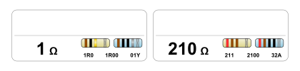

# ResistorLabels
This script generates labels for resistor zip bags.

It is meant for AVERY 5260 Labels and 7x10cm (3"x4") zip bags.

The generated labels include:
  * Resistor value
  * 4- and 5-band color codes
  * 3- and 4-digit smd codes
  * EIA-96 smd code
  

# Usage
* Install python3
* Install the python3 library `reportlab`. This library is used to do the actual PDF generation.
* Modify the script `GenerateLabels.py` and add your own required resistor values in main().
* Run the script `GenerateLabels.py`!

It will now generate a `ResistorLabels.pdf` that can be used to print onto AVERY 5260.

# More Details

This is based on an idea from Zach Pov.

For more details on how these labels are meant to be used, visit his website:

https://www.zachpoff.com/resources/quick-easy-and-cheap-resistor-storage/
